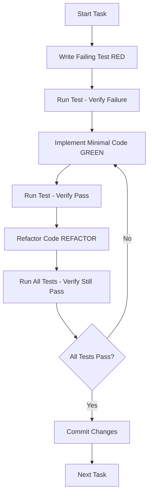

# Parallel Workflow Orchestration Skill

## Overview

This skill enables running **3+ parallel Claude Code sessions** simultaneously, each working on different parts of the EvoFit codebase without conflicts. Each session operates as an independent agent with a specific domain.

## Architecture

### Session Domains (No Overlap)

| Session | Domain | File Paths | Focus |
|---------|--------|------------|-------|
| **Session 1** | Backend API | `backend/src/` | API routes, services, controllers |
| **Session 2** | Frontend UI | `src/app/`, `src/components/` | React components, pages, hooks |
| **Session 3** | Testing & QA | `backend/tests/`, `tests/`, `__tests__/` | Tests, fixtures, mocks |

### Conflict Prevention Rules

1. **File Ownership**: Each session owns exclusive write access to its domain
2. **Read-Only Access**: All sessions can read any file for context
3. **Shared Interfaces**: If interfaces change, communicate via git commits
4. **Commit Frequently**: Each session commits after completing 1 task
5. **Pull Before Push**: Always pull latest changes before starting work

## Parallel Workflow Strategy

### Phase 1: TDD Planning (All Sessions Run in Parallel)

```
Session 1 (Backend):
├── Write failing tests for API endpoints
├── Define request/response schemas
└── Document error scenarios

Session 2 (Frontend):
├── Write component tests for UI
├── Define props interfaces
└── Document user interactions

Session 3 (QA/Integration):
├── Review test coverage gaps
├── Create E2E test scenarios
└── Set up test data fixtures
```

### Phase 2: Implementation (Sequential Within Session)

```
Session 1 (Backend):
├── Implement API endpoints
├── Add input validation
├── Write unit tests
├── Run tests: RED → GREEN → REFACTOR
└── Commit: "feat: implement [endpoint]"

Session 2 (Frontend):
├── Build React components
├── Integrate with API
├── Write component tests
├── Run tests: RED → GREEN → REFACTOR
└── Commit: "feat: implement [component]"

Session 3 (QA/Integration):
├── Run integration tests
├── Test with Claude Chrome Extension
├── Document bugs found
└── Update test suites
```

### Phase 3: Integration (Coordinate via Git)

```
1. All sessions: Pull latest changes
2. Session 3: Run full test suite
3. If conflicts: Resolve in Session 3
4. If failing tests: Assign to owning session
5. When all pass: Merge to main
```

## Ralph Loop TDD Integration

Each session follows the Ralph Loop:



## Session Startup Prompts

See session-specific prompts in `.claude/prompts/`:
- `session-1-backend.md` - Backend API development
- `session-2-frontend.md` - Frontend UI development
- `session-3-qa.md` - Testing and quality assurance

## Monitoring Progress

### Status Tracking

Each session maintains:
1. **Current Story**: Which story from `docs/stories/` is being worked on
2. **Tasks Completed**: Checklist of completed subtasks
3. **Tests Status**: Pass/fail counts
4. **Blockers**: Any dependencies on other sessions

### Synchronization Points

**Every 30 minutes**:
1. All sessions: `git add . && git commit -m "wip: [session-name] progress"`
2. All sessions: `git pull origin main`
3. Session 3: Run full test suite
4. If conflicts: Resolve immediately

**Every 2 hours**:
1. All sessions: Meet to discuss blockers
2. Reassign work if needed
3. Update story statuses

## Claude Chrome Extension Integration

**Session 3 (QA) uses Chrome Extension for**:
1. Visual regression testing
2. User flow testing
3. Accessibility validation
4. Responsive design testing
5. Performance profiling

**Usage**:
```bash
# In Session 3 terminal
1. Start dev server: npm run dev
2. Open Chrome DevTools
3. Enable Claude Extension panel
4. Navigate to pages being tested
5. Capture screenshots and test results
```

## Conflict Resolution Protocol

### Git Conflicts

```
1. Identify which session owns the conflicting file
2. That session resolves the conflict
3. Other sessions pull the resolution
4. Re-run tests to verify
```

### Interface Changes

```
1. Backend changes API contract:
   - Update API documentation
   - Commit with "docs: API contract change"
   - Notify frontend session

2. Frontend needs new API:
   - Create feature request issue
   - Backend session implements
   - Frontend integrates when ready
```

## Best Practices

1. **Small Commits**: Commit after each task completion
2. **Descriptive Messages**: Use conventional commit format
3. **Test First**: Always write tests before implementation
4. **Isolate Changes**: One feature per commit
5. **Communicate**: Use git commits for cross-session communication
6. **Pull Often**: Minimize merge conflicts
7. **Run Tests**: Verify nothing broke before pushing

## Quick Start

1. Open 3 terminal windows
2. In each terminal, run Claude Code
3. Copy the corresponding session prompt from `.claude/prompts/`
4. Paste into the Claude Code session
5. Work in parallel, monitoring progress via git commits

## File Organization

```
.claude/
├── skills/
│   └── parallel-workflow/
│       └── SKILL.md (this file)
├── prompts/
│   ├── session-1-backend.md
│   ├── session-2-frontend.md
│   └── session-3-qa.md
└── agents/
    ├── backend-agent.md
    ├── frontend-agent.md
    └── qa-agent.md
```

## Troubleshooting

**Issue**: Merge conflicts
**Solution**: Session 3 handles resolution, others pull changes

**Issue**: Tests failing
**Solution**: Owning session fixes, others wait

**Issue**: Blocked by other session
**Solution**: Switch to another story, return when unblocked

**Issue**: Can't run in parallel
**Solution**: Check file ownership, ensure no overlap
