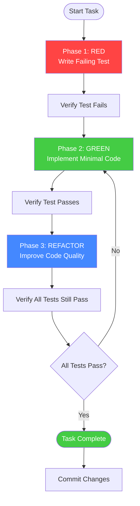

# Ralph Loop TDD Methodology

## Overview

The Ralph Loop is a strict Test-Driven Development methodology that ensures **100% test coverage** and **high code quality** through a disciplined RED-GREEN-REFACTOR cycle.

## The Ralph Loop Cycle



## Phase 1: RED - Write Failing Test

### Goal
Write a test that **fails** because the functionality doesn't exist yet.

### Steps

1. **Understand Requirements**
   - Read the story from `docs/stories/story-XXX-YY.md`
   - Identify acceptance criteria
   - Define test scenario

2. **Write Test First**
   ```bash
   # Before writing ANY production code
   # Example: Writing a test for user login
   ```

   ```typescript
   // backend/tests/auth.test.ts
   describe('POST /api/auth/login', () => {
     it('should return JWT token for valid credentials', async () => {
       const response = await request(app)
         .post('/api/auth/login')
         .send({ email: 'test@example.com', password: 'password123' });

       expect(response.status).toBe(200);
       expect(response.body.token).toBeDefined();
       expect(response.body.user.email).toBe('test@example.com');
     });
   });
   ```

3. **Run Test - Verify It Fails**
   ```bash
   npm test -- auth.test.ts
   ```

4. **Expected Result**: ❌ **FAIL** - Test fails (functionality doesn't exist)

### RED Phase Checklist

- [ ] Test written before implementation
- [ ] Test clearly describes expected behavior
- [ ] Test fails with clear error message
- [ ] Test is isolated (no dependencies on other tests)
- [ ] Test follows Arrange-Act-Assert pattern

## Phase 2: GREEN - Implement Minimal Code

### Goal
Write **minimal code** to make the test pass.

### Steps

1. **Implement Just Enough Code**
   ```typescript
   // backend/src/controllers/authController.ts
   export const login = async (req: Request, res: Response) => {
     const { email, password } = req.body;

     // Validate input
     if (!email || !password) {
       return res.status(400).json({ error: 'Email and password required' });
     }

     // Find user
     const user = await User.findOne({ email });
     if (!user) {
       return res.status(401).json({ error: 'Invalid credentials' });
     }

     // Verify password
     const isValid = await bcrypt.compare(password, user.passwordHash);
     if (!isValid) {
       return res.status(401).json({ error: 'Invalid credentials' });
     }

     // Generate token
     const token = jwt.sign({ userId: user._id }, process.env.JWT_SECRET);

     return res.status(200).json({
       token,
       user: { email: user.email, name: user.name }
     });
   };
   ```

2. **Run Test - Verify It Passes**
   ```bash
   npm test -- auth.test.ts
   ```

3. **Expected Result**: ✅ **PASS** - Test passes

### GREEN Phase Checklist

- [ ] Minimal code written (no extra features)
- [ ] Test passes
- [ ] No hardcoded values (use variables)
- [ ] No implementation of future requirements
- [ ] Code is ugly but functional (refactoring comes next)

## Phase 3: REFACTOR - Improve Code Quality

### Goal
Improve code quality **without changing behavior**.

### Steps

1. **Review Code for Improvements**
   - Extract magic values to constants
   - Create helper functions
   - Improve naming
   - Reduce duplication
   - Add error handling

2. **Refactor Example**
   ```typescript
   // Before refactoring
   const token = jwt.sign({ userId: user._id }, process.env.JWT_SECRET);

   // After refactoring
   const token = generateAuthToken(user);
   ```

   ```typescript
   // Helper function
   export const generateAuthToken = (user: User): string => {
     return jwt.sign(
       { userId: user._id, email: user.email },
       process.env.JWT_SECRET!,
       { expiresIn: '7d' }
     );
   };
   ```

3. **Run All Tests - Verify Still Pass**
   ```bash
   npm test
   ```

4. **Expected Result**: ✅ **ALL PASS** - All tests still pass

### REFACTOR Phase Checklist

- [ ] Code is cleaner and more readable
- [ ] No behavior changed (tests still pass)
- [ ] Duplicated code extracted
- [ ] Magic values replaced with constants
- [ ] Functions have single responsibility
- [ ] Naming is clear and descriptive

## Ralph Loop Commands

### Start Ralph Loop for a Story

```bash
# In Claude Code
@dev Start Ralph Loop for story docs/stories/story-005-01-create-program.md

# Agent will:
# 1. Read the story
# 2. Identify acceptance criteria
# 3. Create test plan
# 4. Begin RED phase
```

### Ralph Loop Status Check

```bash
# Check current phase
@ralph-loop status

# Shows:
# - Current phase (RED/GREEN/REFACTOR)
# - Tests status
# - Coverage percentage
# - Next steps
```

### Skip to Next Phase

```bash
# Only use if current phase is truly complete
@ralph-loop next-phase
```

## Test Coverage Requirements

### Coverage Targets

| Type | Minimum Target | Recommended |
|------|----------------|-------------|
| **Unit Tests** | 80% | 90%+ |
| **Integration Tests** | 70% | 85%+ |
| **E2E Tests** | Critical paths only | All user flows |

### What to Test

**Unit Tests** (Jest):
- Business logic functions
- Utility functions
- Data transformations
- Validation logic

**Integration Tests** (Supertest):
- API endpoints
- Database operations
- External service integrations

**E2E Tests** (Playwright):
- Critical user journeys
- Multi-page flows
- Form submissions
- Authentication flows

## Test File Organization

```
backend/
├── src/
│   ├── controllers/
│   │   └── authController.ts
│   └── services/
│       └── authService.ts
└── tests/
    ├── unit/
    │   ├── services/
    │   │   └── authService.test.ts
    │   └── utils/
    │       └── validation.test.ts
    └── integration/
        └── api/
            └── auth.test.ts

src/
├── components/
│   └── LoginForm.tsx
└── __tests__/
    └── components/
        └── LoginForm.test.tsx
```

## Common Testing Patterns

### API Endpoint Test (Integration)

```typescript
// backend/tests/integration/api/auth.test.ts
import request from 'supertest';
import app from '../../src/app';

describe('POST /api/auth/login', () => {
  beforeEach(async () => {
    // Setup: Create test user
    await User.create({
      email: 'test@example.com',
      passwordHash: await bcrypt.hash('password123', 10)
    });
  });

  afterEach(async () => {
    // Cleanup: Remove test data
    await User.deleteMany({});
  });

  it('should return 401 for invalid credentials', async () => {
    const response = await request(app)
      .post('/api/auth/login')
      .send({ email: 'test@example.com', password: 'wrongpassword' });

    expect(response.status).toBe(401);
    expect(response.body.error).toBeDefined();
  });
});
```

### React Component Test (Unit)

```typescript
// src/components/__tests__/LoginForm.test.tsx
import { render, screen } from '@testing-library/react';
import userEvent from '@testing-library/user-event';
import { LoginForm } from '../LoginForm';

describe('LoginForm', () => {
  it('should show validation error for empty email', async () => {
    const user = userEvent.setup();
    render(<LoginForm onSubmit={jest.fn()} />);

    await user.click(screen.getByRole('button', { name: 'Login' }));

    expect(screen.getByText('Email is required')).toBeInTheDocument();
  });

  it('should call onSubmit with form data', async () => {
    const user = userEvent.setup();
    const handleSubmit = jest.fn();
    render(<LoginForm onSubmit={handleSubmit} />);

    await user.type(screen.getByLabelText('Email'), 'test@example.com');
    await user.type(screen.getByLabelText('Password'), 'password123');
    await user.click(screen.getByRole('button', { name: 'Login' }));

    expect(handleSubmit).toHaveBeenCalledWith({
      email: 'test@example.com',
      password: 'password123'
    });
  });
});
```

## Ralph Loop Completion Checklist

Before marking a story complete:

- [ ] All acceptance criteria have tests
- [ ] All tests pass (100% pass rate)
- [ ] Code coverage meets targets
- [ ] No console warnings or errors
- [ ] Code is refactored and clean
- [ ] Tests are documented
- [ ] E2E tests pass for user flows
- [ ] QA agent review completed

## Integration with Parallel Workflow

When running parallel sessions:

1. **Each session runs independent Ralph Loops**
2. **Session 3 (QA) validates all sessions' tests**
3. **Cross-session integration tests** run in Session 3
4. **No story is complete** until Session 3 validates

## Troubleshooting

**Test won't fail in RED phase?**
- Check if functionality already exists
- If so, test is invalid - rewrite to test new behavior
- Or add assertion for expected failure

**Test passes in RED phase?**
- Test is not testing correctly
- Add more specific assertions
- Ensure test data triggers failure path

**Can't make test pass in GREEN phase?**
- Break into smaller tests
- Implement stub to pass test
- Add TODO comments for missing features

**Tests fail after REFACTOR?**
- Refactoring changed behavior
- Revert refactor
- Make smaller changes
- Run tests after each change
