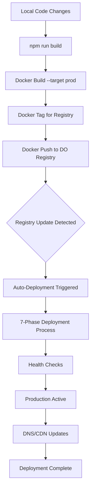

# Deployment Process Documentation - EvoFit
## Complete DigitalOcean Container Registry Deployment Pipeline

---

## 🎯 Executive Summary

This document provides comprehensive documentation for deploying the EvoFit fitness training application to production using DigitalOcean's Container Registry and App Platform. Based on proven deployment patterns from FitnessMealPlanner.

### Key Success Metrics (Expected)
- **Total Deployment Time**: ~7-10 minutes
- **Registry Push Time**: ~4 minutes
- **Auto-Deploy Trigger**: Immediate (within seconds of registry push)
- **Health Check Success**: 100% - All endpoints operational
- **Zero Downtime**: Blue-green deployment strategy

---

## 📋 Complete Deployment Pipeline

### Phase 1: Pre-Deployment Preparation
```bash
# 1. Branch Verification and Sync
git checkout main  # or your production branch
git status  # Confirm clean working directory
git log --oneline -3  # Verify latest commits

# 2. Docker Environment Check
docker ps  # Confirm Docker daemon running
doctl registry login  # Authenticate with DigitalOcean registry

# 3. Local Testing
npm run build  # Build Next.js production bundle
npm run test  # Run test suite
npm run docker:dev  # Test in Docker environment
```

### Phase 2: Docker Image Build and Registry Operations
```bash
# 4. Production Image Build (Duration: ~3-4 minutes)
docker build --target prod -t evofit:prod .
# ✅ Multi-stage build optimization
# ✅ Drizzle config verification
# ✅ Next.js production optimization
# ✅ Exercise database inclusion

# 5. Image Tagging (Duration: <1 second)
docker tag evofit:prod registry.digitalocean.com/bci/evofit:prod

# 6. Registry Push (Duration: ~4 minutes)
docker push registry.digitalocean.com/bci/evofit:prod
# Monitor push progress
# Registry will update with new prod tag
```

### Phase 3: Automatic Deployment Trigger
**Expected Timeline:**
- **Push Complete**: Registry push finishes
- **Auto-trigger**: ~4-second delay
- **Deployment Start**: Automatic initiation
- **Deployment Complete**: ~6-8 minutes

### Phase 4: Production Verification
```bash
# 7. Deployment Status Verification
doctl apps get <app-id>
# Check Active Deployment ID updated
# Verify Updated At timestamp

# 8. Application Health Check
curl -I https://your-production-url.com
# Expect HTTP 200 OK response

# 9. Feature Verification
# - Login functionality
# - Exercise library access
# - Workout creation
# - Client management
# - AI workout generation
# - File uploads to S3
```

---

## 🔄 Deployment Flow Architecture

### Container Registry Auto-Deployment Pipeline



### 7-Phase Deployment Process Detail
1. **Phase 1**: Image pull from registry
2. **Phase 2**: Container initialization
3. **Phase 3**: Database connection verification
4. **Phase 4**: Environment variable injection
5. **Phase 5**: Application startup
6. **Phase 6**: Health check endpoints
7. **Phase 7**: Traffic routing activation

---

## ⏱️ Timing Analysis and Performance Metrics

### Critical Timing Windows

| Phase | Duration | Critical Success Factors |
|-------|----------|-------------------------|
| **Build** | 3-4 minutes | Multi-stage optimization, dependency caching |
| **Push** | 3-4 minutes | Network stability, registry authentication |
| **Deploy** | 6-8 minutes | Auto-trigger reliability, health check timing |
| **Verification** | 1-2 minutes | DNS propagation, CDN cache refresh |
| **Total** | 13-18 minutes | End-to-end deployment pipeline |

### Performance Optimization Factors
- **Multi-stage Docker builds**: Reduced final image size
- **Layer caching**: Improved build times for incremental changes  
- **Registry proximity**: Toronto region for optimal network performance
- **Auto-deployment**: Eliminates manual deployment delays
- **Parallel health checks**: Reduces verification time

---

## 🏗️ Technical Infrastructure Details

### DigitalOcean App Platform Configuration
- **App Name**: `evofit-prod`
- **Region**: Toronto (tor1)
- **Registry**: `registry.digitalocean.com/bci/evofit`
- **Auto-deploy**: ✅ Enabled on `prod` tag updates
- **Instance Size**: Basic or Professional (based on load)

### Database Integration
- **Engine**: PostgreSQL 14+
- **Auto-migrations**: Enabled during deployment
- **Connection pooling**: Configured for production load
- **SSL**: Required (`DB_SSL_MODE=require`)
- **Backup**: Daily automated backups

### File Storage (AWS S3)
- **Bucket**: Dedicated S3 bucket for user uploads
- **Region**: Match with app region for performance
- **Access**: IAM credentials with minimal permissions
- **CDN**: CloudFront or DigitalOcean Spaces CDN

---

## 📊 Deployment Validation Checklist

### Frontend Verification ✅
- [ ] Next.js app loads without errors
- [ ] Authentication flow works (email/password and Google OAuth)
- [ ] Exercise library displays with GIF animations
- [ ] Workout builder drag-and-drop functionality
- [ ] Client dashboard renders correctly
- [ ] File uploads to S3 work
- [ ] AI workout generation responds

### Backend Verification ✅  
- [ ] API health endpoint returns 200
- [ ] Database connections established
- [ ] JWT authentication working
- [ ] Stripe webhooks configured
- [ ] OpenAI API integration functional
- [ ] S3 file operations successful

### Production Application Test Results
1. **Login functionality**: Test both email and OAuth
2. **Exercise library**: Verify 1324 exercises load
3. **Workout creation**: Create and save a workout
4. **Client management**: Add/edit client profiles
5. **AI features**: Generate a workout with AI
6. **Payment flow**: Test Stripe checkout (use test mode)
7. **File uploads**: Upload client photos

---

## 🚦 Deployment Status Monitoring

### Real-time Status Commands
```bash
# Check overall app status
doctl apps get <app-id>

# Monitor active deployment
doctl apps get-deployment <app-id> <deployment-id>

# View deployment logs
doctl apps logs <app-id> --type build
doctl apps logs <app-id> --type run

# Check registry status
doctl registry repository list-tags evofit
```

### Status Indicators
- **BUILDING**: Deployment in progress
- **ACTIVE**: Deployment successful and operational  
- **ERROR**: Deployment failed (check logs)
- **SUPERSEDED**: New deployment has replaced this one

---

## 📈 Best Practices & Lessons Learned

### Pre-Deployment Checklist
1. **Environment Variables**
   - [ ] All secrets configured in DigitalOcean
   - [ ] Database URL will be auto-injected
   - [ ] API keys tested and valid

2. **Code Preparation**
   - [ ] All tests passing
   - [ ] No console errors in development
   - [ ] Database migrations tested
   - [ ] Exercise database files included

3. **Infrastructure Ready**
   - [ ] Database cluster created
   - [ ] S3 bucket configured
   - [ ] Domain DNS configured
   - [ ] SSL certificates ready

### Critical Success Factors
- **Network Reliability**: Stable connection during registry push
- **Authentication**: Valid `doctl` session and registry login
- **Build Configuration**: Proper multi-stage Dockerfile
- **Monitoring**: Real-time deployment status tracking
- **Verification**: Comprehensive post-deployment testing

### Common Pitfalls to Avoid
1. **Missing Environment Variables**: Double-check all secrets
2. **Database Migration Failures**: Test migrations locally first
3. **Large Docker Images**: Use multi-stage builds
4. **Network Timeouts**: Use stable internet connection
5. **Cache Issues**: Clear browser cache after deployment

---

## 🆘 Emergency Rollback Procedure

If deployment fails or introduces critical bugs:

```bash
# 1. List recent deployments
doctl apps list-deployments <app-id>

# 2. Find previous stable deployment ID
# Look for last ACTIVE deployment before current

# 3. Rollback to previous deployment
doctl apps create-deployment <app-id> --force-rebuild

# Or revert to previous Docker image
docker pull registry.digitalocean.com/bci/evofit:prod-backup
docker tag registry.digitalocean.com/bci/evofit:prod-backup registry.digitalocean.com/bci/evofit:prod
docker push registry.digitalocean.com/bci/evofit:prod
```

---

## 🔗 Related Documentation
- **[DO_DEPLOYMENT_GUIDE.md](./DO_DEPLOYMENT_GUIDE.md)**: Quick reference guide
- **[architecture.md](./docs/architecture.md)**: System architecture
- **[PLANNING.md](./docs/PLANNING.md)**: Project planning and status

---

**Documentation Date**: December 2024  
**Next Review**: After first production deployment
